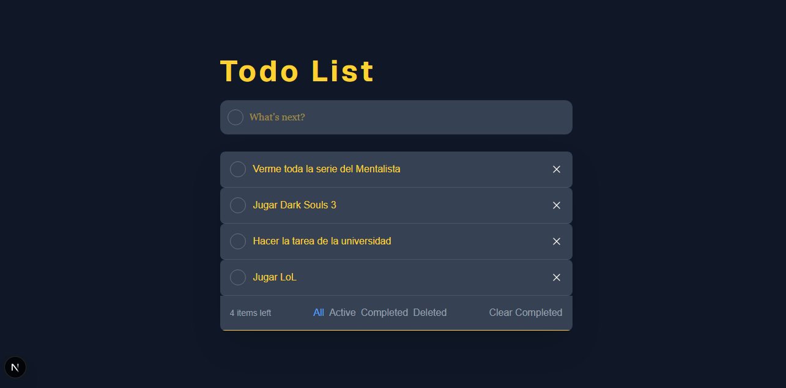

# 📝 Todo List — BPDS

<p align="center">
  
  
  
  
</p>

Aplicación de lista de tareas (**CRUD completo**) construida con **Next.js**, **TypeScript** y **Tailwind CSS**, desarrollada en equipo para la materia de Desarrollo de Software.

<p align="center">



</p>
---

## 📑 Contenido

- [Instalación](#-instalación)
- [Ejecutar el proyecto](#️-ejecutar-el-proyecto-localmente)
- [Funcionalidades](#-funcionalidades-principales)
- [Integrantes](#-integrantes-del-equipo)
- [Tecnologías](#️-tecnologías-utilizadas)

---

## 🚀 Instalación

Clona el repositorio e instala las dependencias del proyecto:

```bash
git clone https://github.com/ChrisAltF4/BPDS.git
cd BPDS
npm install
```

## ▶️ Ejecutar el proyecto localmente

Una vez instaladas las dependencias, levanta el servidor de desarrollo:

```bash
npm run dev
```

Luego abre tu navegador en **[http://localhost:3000](http://localhost:3000)** para ver la aplicación funcionando.

---

## ✨ Funcionalidades principales

La aplicación implementa el ciclo **CRUD** completo sobre las tareas, además de un sistema de filtros y una papelera de tareas eliminadas.

| Funcionalidad | Descripción |
|---|---|
| ➕ **Crear** | Escribe en el campo de texto y presiona **Enter** para agregar una tarea (sin necesidad de botón). |
| 📋 **Leer** | Todas las tareas se muestran automáticamente en la lista principal. |
| ✅ **Actualizar (tachar)** | Haz clic en el círculo de cada tarea para marcarla como completada. Se tacha visualmente, **sin eliminarse**. |
| ✏️ **Actualizar (editar)** | Haz clic sobre el texto de una tarea para editarla en el lugar. El cambio se guarda solo al hacer clic fuera del campo (sin botón "guardar"). |
| ❌ **Eliminar** | El botón **✕** de cada tarea la elimina por completo de la lista principal. |
| 🔍 **Filtros** | Botones **All / Active / Completed / Deleted** para ver solo las tareas de cada categoría. |
| 🗑️ **Papelera de eliminadas** *(nueva feature)* | Al eliminar una tarea, su nombre se guarda en un historial. Se consulta desde la pestaña **Deleted**, mostrando solo los nombres (sin opción de recuperarlas). |
| 🧹 **Clear Completed** | Elimina de golpe todas las tareas ya marcadas como completadas. |
| 🔢 **Contador de tareas** | Muestra cuántas tareas quedan pendientes ("X item left"). |

---

## 🛠️ Tecnologías utilizadas

- [Next.js](https://nextjs.org/) (App Router)
- [TypeScript](https://www.typescriptlang.org/)
- [Tailwind CSS](https://tailwindcss.com/)
- [React](https://react.dev/) (useState, useEffect)
